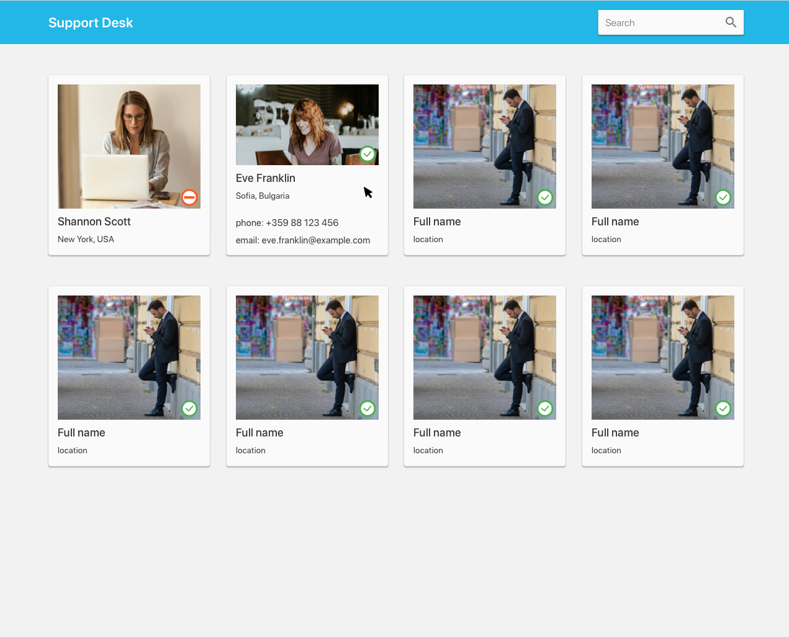

# Support Desk app 

Simple Support Desk app that should look similar to the following mockup.

## Languages and libraries used
- React.js. 
- Javascript
- Html/Css
- uuid

## Short description
- Using [assets/api.json](assets/api.json) file to simulate Web API calls.
- Single Page App (SPA) - React.js.
- Responsive design by using responsive CSS units - working on mobile, tablet and desktop.
- More details come up when you hover person (phone and email).
- Status icon depending on the person's status. Using [assets/icon-available.svg](assets/icon-available.svg) if the person is available, [assets/icon-busy.svg](assets/icon-busy.svg) otherwise. 
- Basic search functionality implemented. Using [assets/icon-search.svg](assets/icon-search.svg) for the search bar.

## Architecture - the project is structured with scalability in mind as follows:
- `client` folder contains the whole project.
- `public` folder contains global asssets for the app(including the json file for simulating Web API calls).
- `src` folder contains the `App.js`, `index.js` and folders for the components, context(s), and service(s).
- `components` folder - properly named folder for each component that includes the component itself, the css module for the component, testfile and asseet needed for the component(if any).
- `services` folder - contains unified requester and service (for each resource) for handling AJAX requests. 
- `contexts` folder.

## Available Scripts

In the project directory `client`, you can run:

### `npm start`

Runs the app in the development mode.\

Open [http://localhost:3000](http://localhost:3000) to view it in your browser.

The page will reload when you make changes.\
You may also see any lint errors in the console.

### `npm test`

Launches the test runner in the interactive watch mode.\